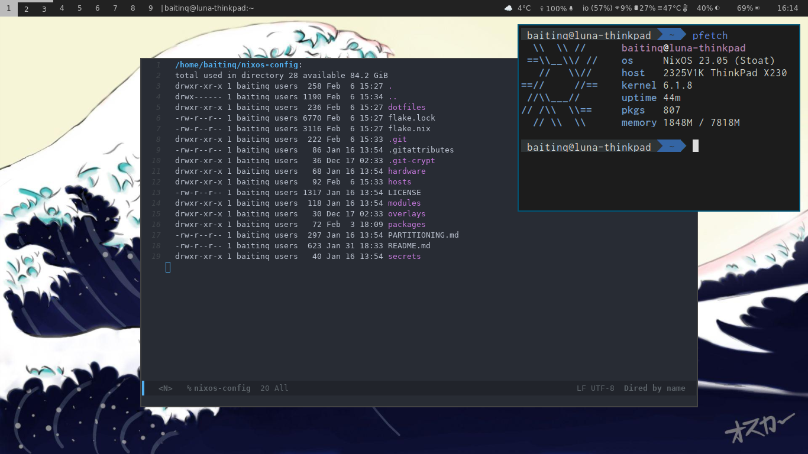

# NIX Config

My current (and everchanging) NixOS configuration Flake.



## Installation

Installation steps are in [Documentation/INSTALLING.md](./Documentation/INSTALLING.md)

## Highlights

* Multiple NixOS configurations, including desktop, laptop, and VM
* Install and partitioning scripts
* **Impermanence**
* Encrypted **BTRFS** partitions
* Secrets using **git-crypt**
* Network-deployable through **deploy-rs**
* Modularized configuration
* Wayland (*sway*) and XOrg (*XMonad*) desktops

## Structure

Here is an overview of the repos' structure:

<!--
actually `plaintext`, but github haskell syntax highlighting works well with source tree
`qml` syntax highlighting is also very good for this
-->
```hs
.
├── flake.nix
├── flake.lock
├── modules
├── overlays
├── packages
├── secrets
├── dotfiles
├── hosts
│  ├── default.nix
│  ├── configuration.nix
│  ├── home.nix
│  ├── luna
│  └── phobos
│     ├── default.nix
│     └── home.nix
└── hardware
   ├── laptop
   ├── chromebook
   ├── virtualbox
   └── thinkpad
      ├── default.nix
      ├── disks.nix
      └── hardware.nix
```

* `modules`: encapsulated NixOS modules used in parts of the config
* `overlays`: nixpkgs overlays used in the config
* `packages`: extra packages used in the config
* `secrets`: git-crypt encrypted secrets used in the config
* `dotfiles`: actual dotfiles used in the config
* `hosts`: the host-specific config. Contains folders representing each host with their own specific config
* `hardware`: the hardware-specific config (eg. Disks & Partitions). Contains folders representing each hardware

**This configuration was made to be modular and customizable; don't hesitate to adopt it and make it YOURS!**
